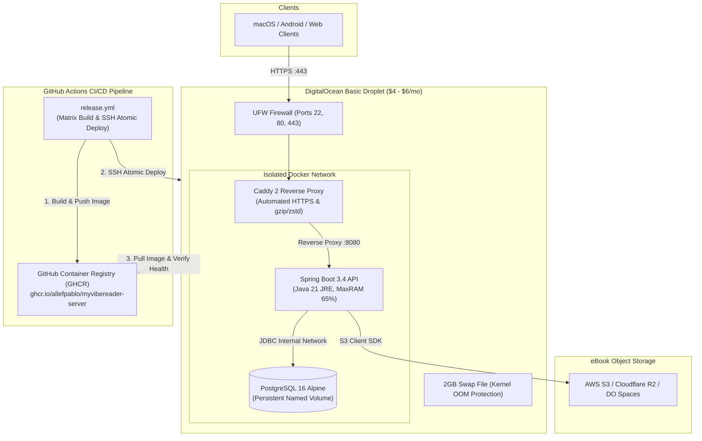

# DigitalOcean Deployment & Automated CI/CD Guide

This document outlines the **production-grade, lowest-cost architecture** ($4 – $6/month total) to deploy **MyVibeReader** to DigitalOcean, along with **automated continuous deployment (CD)** triggered on every new GitHub Release.

---

## 1. Cost Breakdown & Architecture Overview

| Component | Provider & Plan | Monthly Cost |
| :--- | :--- | :--- |
| **Server & Database Host** | DigitalOcean Basic Droplet (1 vCPU, 512MB–1GB RAM, 10–25GB SSD) | **$4.00 – $6.00 / mo** |
| **Container Registry** | GitHub Container Registry ([GHCR](https://ghcr.io)) | **$0.00** (Free) |
| **SSL / TLS Termination** | Caddy 2 Reverse Proxy (Automated Let's Encrypt / ZeroSSL) | **$0.00** (Free) |
| **Object Storage (eBooks)** | AWS S3 Free Tier (5GB) or [Cloudflare R2](https://developers.cloudflare.com/r2/) (10GB free, $0 egress) | **$0.00** |
| **CI / CD Pipeline** | GitHub Actions ([`.github/workflows/release.yml`](.github/workflows/release.yml)) | **$0.00** (Free tier) |
| **Total Estimated Cost** | | **$4.00 – $6.00 / month** |

---

## 2. Architecture & Software Engineering Best Practices



### Key Engineering Best Practices Implemented:
1. **Immutable Container Builds**: Every release tag generates a versioned Docker image (`ghcr.io/<owner>/myvibereader-server:v1.0.0`) stored in GitHub Packages.
2. **Atomic Rolling Deployments with Health Checks**: [`deploy/deploy.sh`](deploy/deploy.sh) pulls the release tag, restarts the `app` container, and polls Spring Boot's `/actuator/health` endpoint. If the health check fails, the deployment aborts with detailed logs.
3. **Automated SSL Lifecycle**: [`deploy/Caddyfile`](deploy/Caddyfile) provisions and automatically renews Let's Encrypt certificates for your custom domain.
4. **Low-Memory JVM Optimization**: JVM flags (`-XX:+UseContainerSupport -XX:MaxRAMPercentage=65.0 -XX:+ExitOnOutOfMemoryError`) combined with an automated 2GB swap space prevent out-of-memory crashes on $4–$6 Droplets.
5. **Zero-Trust Network Isolation**: PostgreSQL runs on an internal Docker bridge network unreachable from the public internet; Droplet UFW firewall opens only ports `22`, `80`, and `443`.
6. **Multi-Provider S3 Compatibility**: [`S3Config.java`](server/src/main/java/com/myvibereader/config/S3Config.java) supports custom endpoint overrides (`S3_ENDPOINT`), enabling zero-cost storage on Cloudflare R2 or DigitalOcean Spaces.

---

## 3. Step-by-Step Deployment Instructions

### Phase 1: DigitalOcean Droplet & DNS Setup

1. **Create a DigitalOcean Droplet**:
   - Log in to your [DigitalOcean Console](https://cloud.digitalocean.com/).
   - Click **Create $\rightarrow$ Droplets**.
   - **Image**: Select **Ubuntu 24.04 LTS** (or 22.04 LTS).
   - **Size**: Select **Basic** $\rightarrow$ **Regular SSD** $\rightarrow$ **$4/mo** (512MB RAM) or **$6/mo** (1GB RAM, recommended for Java).
   - **Authentication**: Add your SSH Public Key (recommended over password).
   - Click **Create Droplet** and copy the **IPv4 Address**.

2. **Configure Domain / DNS (Optional for Automatic HTTPS)**:
   - In your domain DNS registrar (Cloudflare, Namecheap, Route 53, etc.), create an **A Record**:
     - **Name**: `api` (or `@` for apex) $\rightarrow$ `api.yourdomain.com`
     - **Target / Value**: Your Droplet IPv4 address
     - **TTL**: Auto / 5 minutes

---

### Phase 2: One-Time Droplet Server Provisioning

1. **SSH into your Droplet**:
   ```bash
   ssh root@<YOUR_DROPLET_IP>
   ```

2. **Run the Initialization Script**:
   Execute the automated provisioning script [`deploy/setup-droplet.sh`](deploy/setup-droplet.sh) to configure 2GB swap, install Docker/Docker Compose, set up firewall rules (ports 22, 80, 443), and create the deployment directory `/opt/myvibereader`:
   ```bash
   curl -fsSL https://raw.githubusercontent.com/allefpablo/MyVibeReader/main/deploy/setup-droplet.sh | bash
   ```

3. **Configure Production Environment Secrets**:
   Copy the template and edit your production secrets on the Droplet:
   ```bash
   cp /opt/myvibereader/.env.prod.example /opt/myvibereader/.env
   nano /opt/myvibereader/.env
   ```
   Fill in:
   - `DOMAIN`: Your custom domain (e.g. `api.yourdomain.com`) for automated HTTPS, or `:80` for standard HTTP.
   - `ACME_EMAIL`: Your email (for Let's Encrypt renewal alerts).
   - `POSTGRES_PASSWORD`: A secure random password.
   - `JWT_SECRET`: A 256-bit key (generate on your terminal via `openssl rand -base64 48`).
   - `S3_BUCKET_NAME`, `AWS_ACCESS_KEY_ID`, `AWS_SECRET_ACCESS_KEY`, `AWS_REGION`: Your S3 or Cloudflare R2 credentials.
   - `S3_ENDPOINT`: (Leave empty for AWS S3; or set to `https://<accountid>.r2.cloudflarestorage.com` for Cloudflare R2).

---

### Phase 3: GitHub Repository Configuration

1. **Enable GitHub Actions Package Permissions**:
   - Go to your repository on GitHub $\rightarrow$ **Settings** $\rightarrow$ **Actions** $\rightarrow$ **General**.
   - Under **Workflow permissions**, select **Read and write permissions** (allows publishing Docker images to GitHub Container Registry `ghcr.io`).
   - Click **Save**.

2. **Configure Deployment Secrets**:
   - Go to **Settings** $\rightarrow$ **Secrets and variables** $\rightarrow$ **Actions** $\rightarrow$ **New repository secret**.
   - Add the following secrets:
     - `DO_HOST`: Your Droplet IP address (e.g. `164.92.100.50`)
     - `DO_USER`: SSH user (e.g. `root`)
     - `DO_SSH_KEY`: The private SSH key whose public counterpart is on the Droplet (the contents of `~/.ssh/id_rsa` or dedicated deploy key)
     - `DO_PORT`: `22` (optional, default is `22`)

---

### Phase 4: Triggering Automated Release & Continuous Deployment

Whenever you are ready to publish a new release and deploy to your server:

1. **Commit and push your changes to `main`**:
   ```bash
   git add .
   git commit -m "feat: configure automated DigitalOcean deployment"
   git push origin main
   ```

2. **Create and push a Git version tag**:
   ```bash
   git tag v1.0.0
   git push origin v1.0.0
   ```

3. **What GitHub Actions ([`.github/workflows/release.yml`](.github/workflows/release.yml)) will do automatically**:
   - **Builds**: Spring Boot JAR, macOS DMG/App bundle, and Android APKs.
   - **Docker Build & Push**: Builds and pushes `ghcr.io/<owner>/myvibereader-server:v1.0.0` to GitHub Container Registry.
   - **Publishes Release**: Creates the GitHub Release with attached downloadable binaries.
   - **Deploys to DigitalOcean**: Connects to the Droplet via SSH, copies production compose files, pulls the new container, restarts the app, and validates that `/actuator/health` returns `{"status":"UP"}`.

---

### Phase 5: Client Connection

In your client application, set the production API endpoint:
- In [`client/.env`](client/.env) or build settings, point `VITE_API_URL` to your production domain:
  ```env
  VITE_API_URL=https://api.yourdomain.com/api
  ```
- Any macOS or Android native app build will automatically connect to your DigitalOcean backend server.
