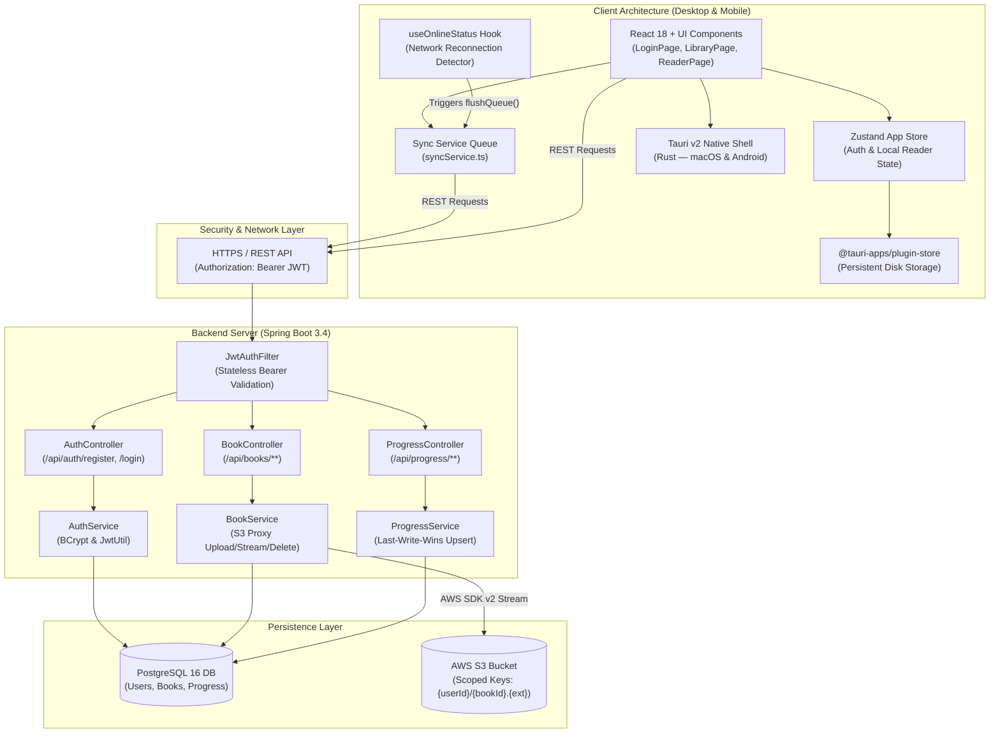
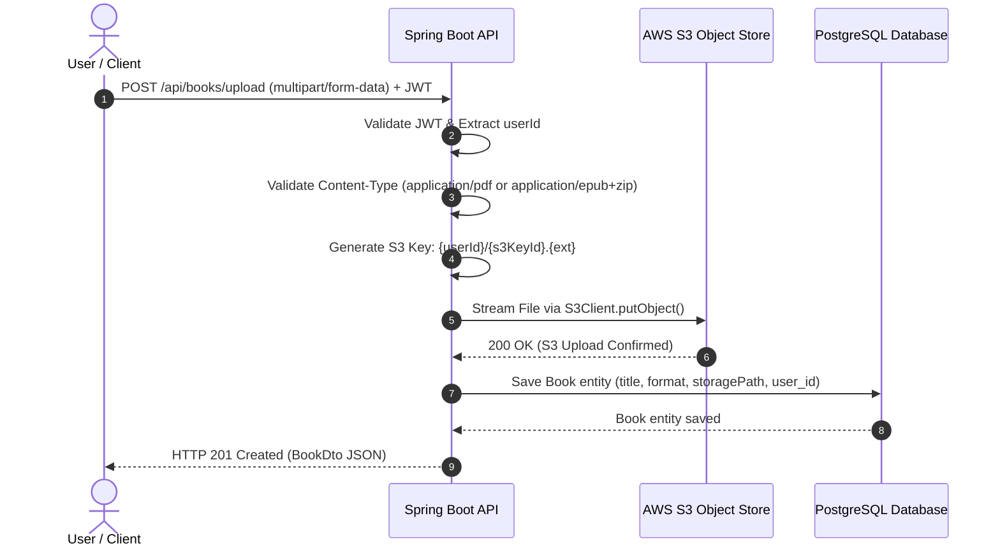
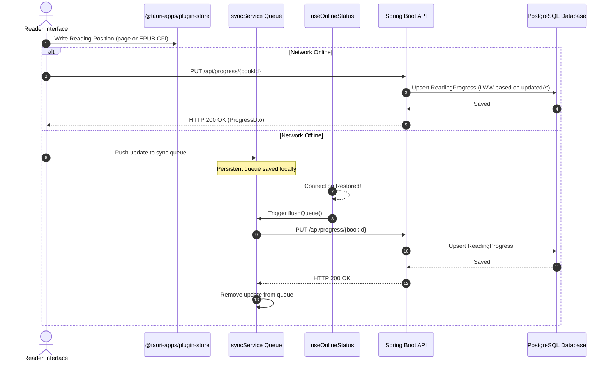
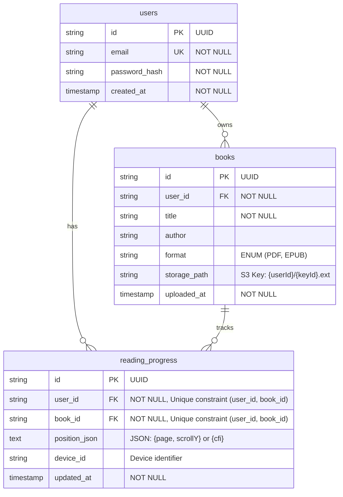
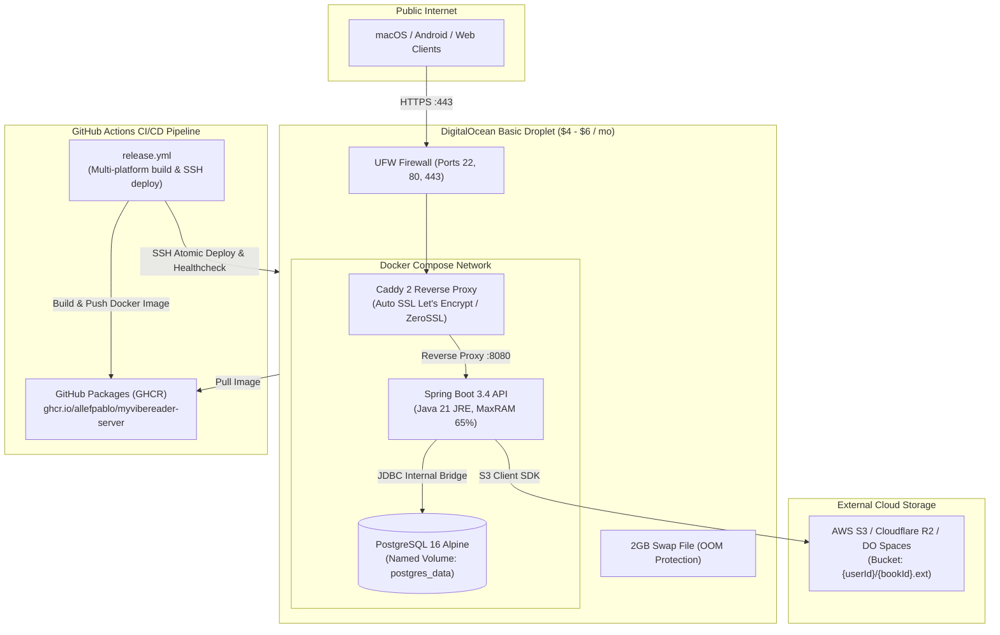

# MyVibeReader — System Design Document

This document provides a comprehensive technical design and architectural specification for **MyVibeReader**, a cross-platform eBook reading application supporting PDF and EPUB formats with offline reading position tracking and cross-device cloud sync.

---

## 1. High-Level System Architecture

---

## 2. Sequence Diagrams

### 2.1 Backend Proxy eBook Upload & Stream Download Flow
Files are uploaded and downloaded through a server proxy pattern so client code never needs S3 presigned credentials or complex S3 CORS configuration.

---

### 2.2 Offline Reading & Reconnection Progress Sync Flow
Positions are saved locally when offline and flushed to the backend using a timestamp-based Last-Write-Wins resolution strategy upon reconnection.

---

## 3. Entity Relationship Diagram (Database Schema)

---

## 4. Key Component Responsibilities

### 4.1 Client Components
* **Tauri v2 Native Shell**: Hosts cross-platform webview for macOS desktop and Android mobile native builds. Includes Rust build script configuration for Android 15+ 16 KB ELF page alignment (`-Wl,-z,max-page-size=16384`).
* **React 18 & Router**: Declarative UI pages (`LoginPage`, `LibraryPage`, `ReaderPage`).
* **TanStack Query Auto-Sync**: Manages server state with 3-second polling interval on library queries (`refetchInterval: 3000`) and window focus refetching (`refetchOnWindowFocus: true`) for real-time cross-device library synchrony.
* **Zustand & `@tauri-apps/plugin-store`**: Synchronous local state combined with persistent disk storage for offline access.
* **IndexedDB Binary Cache (`fileCacheService`)**: Stores downloaded PDF and EPUB binary blobs locally for offline reading without network requests to S3.
* **Offline Sync Engine (`useOnlineStatus` + `syncService` + `useProgress`)**: Listens to network status, ensures non-destructive initial rendering in PDF and EPUB viewers, and drains the persistent queue via `PUT /api/progress/{bookId}` upon reconnection.

### 4.2 Server Components
* **Stateless JWT Security Filter (`JwtAuthFilter`)**: Intercepts requests, validates Bearer tokens via `JwtUtil`, and injects user identity into Spring Security context (`@AuthenticationPrincipal String userId`).
* **Book Proxy Service (`BookService`)**: Validates eBook file signatures/content types, streams file binaries directly to AWS S3 (`downloadBook`), deletes S3 objects (`deleteBook`), and records metadata in PostgreSQL.
* **Progress Service (`ProgressService`)**: Manages reading position synchronization per user and per book using Last-Write-Wins semantics based on `updatedAt`.

---

---

## 5. Security Architecture & Defense-in-Depth Controls

The application enforces a multi-layered security model across client, network, service, and storage tiers:

### 5.1 File Ingestion & Object Storage Security
* **Magic Byte Signature Inspection**: `BookService` validates file headers using non-destructive `BufferedInputStream` mark/reset (`%PDF-` for PDFs, `PK\x03\x04` for EPUBs), rejecting disguised binaries or MIME-spoofed payloads with `400 Bad Request`.
* **Streaming Downloads (DoS Prevention)**: eBook downloads stream through `ResponseInputStream` directly to `InputStreamResource`, bypassing server heap buffering to prevent memory exhaustion and heap starvation attacks.
* **30MB File Size Limits**: Enforced at the servlet container boundary (`spring.servlet.multipart.max-file-size: 30MB`), domain service layer (`BookService.MAX_FILE_SIZE_BYTES`), and client pre-flight check (`fileValidation.ts`), returning `413 Payload Too Large`.
* **Path Traversal & Unicode Title Sanitization**: `BookService.sanitizeTitle` strips POSIX (`/`) and Windows (`\`) directory components, removes control characters (`[\p{Cntrl}]`), eliminates bidirectional override (RTLO) spoofing characters, collapses whitespace, caps titles at 255 characters, and falls back to `"Untitled"`.

### 5.2 Network & CORS Whitelisting
* **Strict CORS Whitelisting**: Removed wildcard `*` origins in `SecurityConfig`. Whitelists explicit local development ports (`1420`, `5173`), configurable `CORS_ALLOWED_ORIGINS` environment variables, and Tauri application schemes (`tauri://localhost`, `https://tauri.localhost`, `http://tauri.localhost`).

### 5.3 Sync Engine Validation & Clock Tampering Mitigations
* **Last-Write-Wins & Skew Defense**: `ProgressService` rejects client timestamps more than 5 minutes in the future (`400 Bad Request`) to prevent permanent progress locking, and discards stale updates where `incomingTimestamp < existing.updatedAt`.
* **Reading Progress Schema Enforcement**: `ProgressDto` applies Jakarta `@NotBlank` and `@Size(max = 2000)` on `positionJson` and `@Size(max = 100)` on `deviceId`. `ProgressService` verifies that PDF positions contain integer `page >= 1` and non-negative `scrollY`, while EPUB positions contain non-blank `cfi`.

### 5.4 Client Webview & Render Sandboxing
* **Strict Tauri Content Security Policy**: `tauri.conf.json` enforces `default-src 'self'`, `object-src 'none'`, and `frame-ancestors 'none'`, permitting required `blob:` workers for PDF/EPUB rendering while blocking remote script execution.
* **EPUB Content Sanitization**: `sanitizeEpub.ts` strips all `<script>`, `<object>`, `<embed>`, `<applet>`, `<iframe>`, `<frame>`, and `<base>` elements, strips inline `on*` event handlers, neutralizes `javascript:`, `vbscript:`, and `data:text/html` schemes, and enforces `rel="noopener noreferrer"`. `EpubViewer.tsx` renders with `allowScriptedContent: false` and registers `rendition.hooks.content` DOM sterilization before rendering.

### 5.5 Authentication Lifecycle & Session Hardening
* **JWT Integrity & Expiration Inspection**: `jwt.ts` verifies 3-part structure and `exp` claims. On boot and during `setAuth`, `appStore.ts` auto-purges expired or corrupted tokens.
* **Automatic 401/403 Session Eviction**: `api.ts` automatically invokes `useAppStore.getState().logout()` when an authenticated API call receives HTTP 401 or 403, evicting stale tokens and redirecting to the login screen.

---

## 6. Production Deployment Architecture (DigitalOcean)

---

## 7. Implementation Verification Status

All architectural components described in this document are **100% fully implemented and verified**:
* **Backend**: 75 automated unit and integration tests passing (`./mvnw test`).
* **Frontend**: 28 automated Vitest unit tests passing (`npm test`) and TypeScript compilation clean (`npx tsc --noEmit`).
* **DevOps**: Docker, Caddyfile, Droplet setup script, GHCR container publishing, and automated SSH zero-downtime deployment workflow ready.
